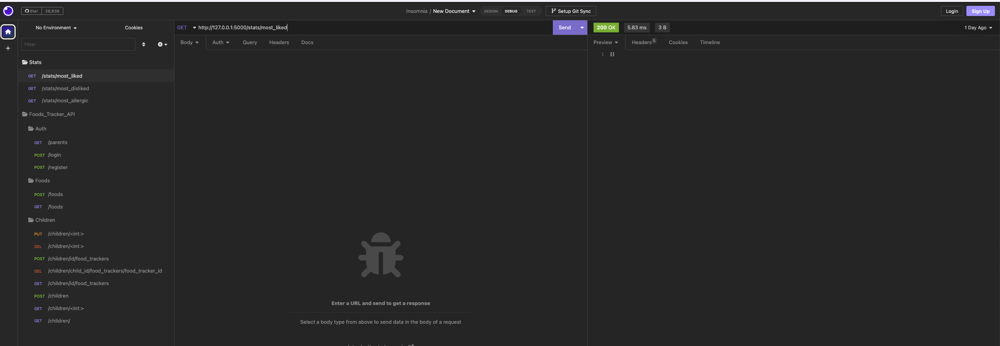
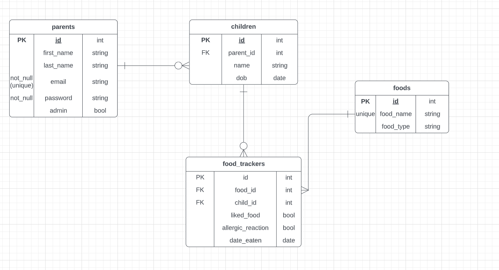
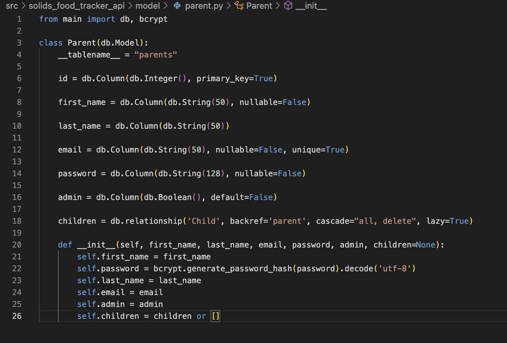
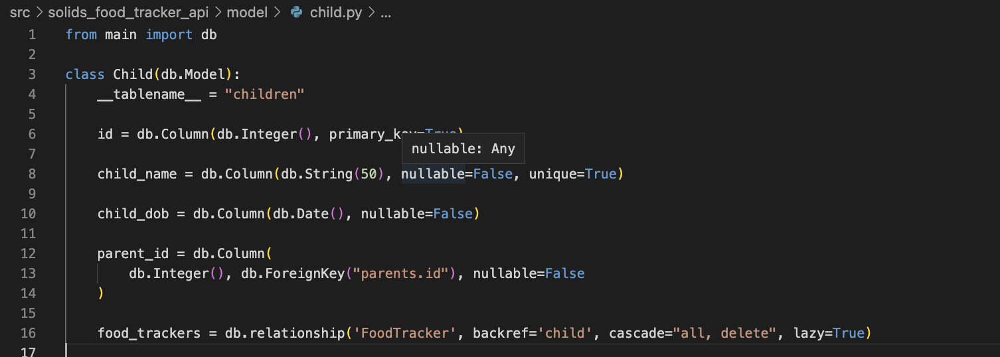
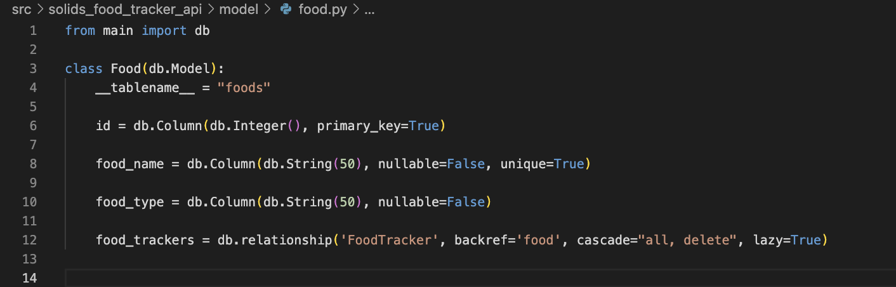
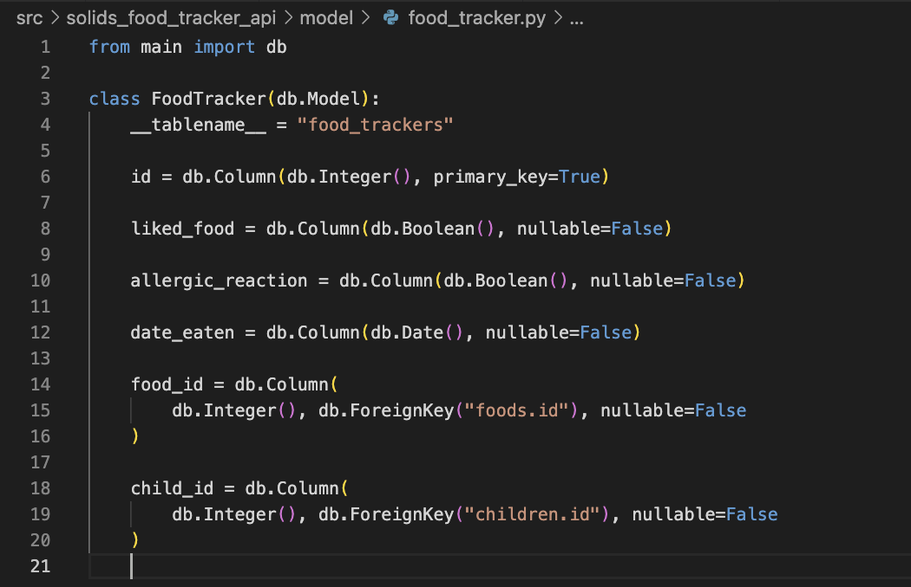
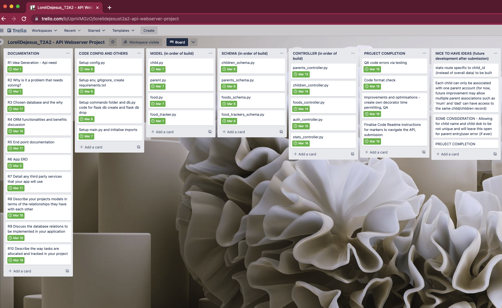

___
## R1 Identification of the problem you are trying to solve by building this particular app and R2 Why is it a problem that needs solving?  
___

**Background**: As babies grow older, solid food becomes an essential addition to their diet in order to get enough nutrients for continued growth and development. Introducing solids is important for helping babies learn to eat, giving them the experience of new tastes and textures from a range of foods, and helping prepare for more independent skills as they grow older. Additionally, there are studies that also note that babies who are exposed to or have consumed sufficient amounts of allergenic foods early on may be an effective method in food allergy prevention for the long term. Early diversity in diet allows the body to develop immunity and help prevent food allergies that may develop later down the track (Mikkelsen, A., Nadeau,K., Swanson, W. 2022). 

**Problem**:  Parents and carers have their hands full and can use as much help available. The to-do list is never ending and remembering every single detail of everything (laundry, daycare pick ups, grocery list, walking the dog, cleaning etc) is not easy and frankly, does not help with a parent/carer’s mental load. 

A child needs to be fed. This starts off with milk in the early weeks/months but it will transition to consumption of solids at some point in a child’s first years. With food allergies prevalent today, it is important to try to understand if a baby/child is allergic to anything, and if so, provide measures to ensure that this does not limit or affect their future. 

Introducing the Solids Food Tracker for babies API - this will enable parents and carers to monitor and track the wide variety of solid foods they plan to introduce to their baby. There is currently a similar application in the market that touches on this feature, however, this is a paid subscription. Further, the focus of that current application is instructions on how to serve solid foods safely, and have the tracking feature as an add on. The focus of my API project is aid tracking and I believe this aid should be accessible to all and this project aims to deliver a product that is useful, relevant and freely-accessible.

**API Objective**: Parents/Carers are able to keep track of what food they have tried introducing to their baby. The objective is to try as many food and food types as possible in little quantities to start, before progressing. It will be helpful to keep track of this and also note food that the baby liked and any food that they had reactions to, thus, helping with future menu preparations and household food planning.

As mentioned, studies have found that variety over quantity in consistency is a good way to start introducing solid food to babies. With this amount of data needing to be monitored, a tracker is helpful in keeping on top of the list as well as useful for understanding foods to avoid (highly allergic) or food to re-introduce again next time (if not liked the first time or mild reaction). 

Target market: Parents/carers who are in the process of introducing solid food for the first time to the baby/babies under their care.

**References**:

Mikkelsen, A., Nadeau,K., Swanson, W. (2022). Retrieved from https://www.emjreviews.com/allergy-immunology/symposium/changing-the-way-babies-eat-supporting-early-allergen-feeding-around-the-world-j01121/

___

## R3 Why have you chosen this database system. What are the drawbacks compared to others?
___

For my web server API, I have chosen to utilise a relational database system, which is a collection of items, organised in tables with attributes (columns) and data (row), and have established relationships among them. I have chosen this type of database system because it is simple to use, has fast performance, secure,  presents data accurately and supports multi-users. It is simple to use as there is no need for any type of query processing and the complexity is taken off with users not needing to pass complex queries, SQL queries will suffice. With this straightforward and easy structure, the resulting advantage is optimal user experience. There are many opportunities to optimise and access data options, thus, resulting in faster performance. It is secure because the database uses tables and rows that are protected with usernames and passwords and with authorisation layers in order to manage correct access. Further, data is presented accurately because of the clear distinction and use of primary and foreign keys in establishing the relations between the tables. Duplication is prevented and this drives the strength of accuracy with this type of database system. And in terms of user access, multi-user access is supported and this is very important in ensuring that users have a smoother experience and no unnecessary system crashes happen. 

There are some disadvantages as well of this type of database system - most of which relate to the size and number of table rows and columns required. For my api server, the required rows and columns will not be extravagant and so the relational database system is the most appropriate to be utilised. However, I will go on and also discuss some drawbacks to be across when utilising this type of system. 

As mentioned, with the increase in data requirement, this can also affect performance level. If there are more rows and columns, the query will take longer to process as it can slow down the whole working process and disrupt user experience. As much as I initially mentioned that it is simple to use, it can also be complex to understand. “When the amount of stored data increases, it becomes complicated to understand those data in simplified form. It happens because every data has kept using the particular feature that builds vast data sets to filter” (Kumar n.d.). There is also a requirement for use of actual physical storage devices as physical memory devices for proper optimisation. RDBMS itself is limited in space and if there is no more storage, the possibility of losing data is present. Lastly, RDBMS can be an expensive investment with software and tools needed to get its full advantage. 

**Reference**:

Kumar, S. (n.d.) Retrieved from https://www.thecrazyprogrammer.com/2021/09/advantages-and-disadvantages-of-relational-database.html 
 
___
## R4 Identify and discuss the key functionalities and benefits of an ORM
___

An ORM (Object-Relational Mapping) is a technique for mapping between a relational database and object-oriented programming languages such as the likes of python. Developers can utilise ORM to interact with the database using objects and classes instead of directly writing SQL queries. 

Below are the key functionalities and benefits of using an ORM:

1. Database independence: ORMs give the power of code reusability independent of the underlying database system. This means that the same code can be used with different databases, without having to rewrite the code for each specific database.

2. Object-oriented programming (OOP): ORM provides easier code modularity whereby OOP concepts (i.e. inheritance, polymorphism, encapsulation and more) can be used in working with the different database systems. 

3. Simplified query generation: ORMs provide efficiency as no complex queries need to be written manually. ORMs automatically generate SQL queries based on the database schema and the query parameters, thus, provide a simplified query generation overall. 

4. Data validation: ORMs provide a layer of validation that is built-in to make sure that data added or updated in the database is accurate and consistent. 

5. Performance optimisation: ORMs can optimise database queries and help improve overall performance. It does this through reducing the number of queries or optimising the code itself. Functions such as lazy loading, batching, caching and more are just some of the optimisation examples. 

6. Database migrations: ORMs can help with database migrations through automatic updating of database schema along with code changes.

7. Overall, ORMs simplify the process of working with relational databases, making it easier and faster to write maintainable code. It allows developers to work with objects rather than raw database tables and rows, thus, making it easier, faster and more flexible in writing code that is less prone to errors and modifiable over time. 

**References**: 

-Joyos, M. (2013). Retrieved from https://blog.bitsrc.io/what-is-an-orm-and-why-you-should-use-it-b2b6f75f5e2a

-Abba, I. (2022). Retrieved from https://www.freecodecamp.org/news/what-is-an-orm-the-meaning-of-object-relational-mapping-database-tools/

-Loopback (2023). Retrieved from https://loopback.io/doc/en/lb4/Validation-ORM-layer.html#:~:text=The%20validation%20in%20the%20ORM,databases%2C%20such%20as%20unique%20index

-Trask, J. (2012). Retrieved from https://www.infoq.com/articles/optimizing-orm-performance/

-Araskumar, A. (2019). Retrieved from 
https://www.opensourceforu.com/2019/07/simplify-database-migration-by-using-object-relational-mapping/

___
## R5 Document all endpoints for your API
___

1. **Auth controller** 

A. http://127.0.0.1:5000/auth/register

- HTTP request verb: POST 

- Required data where applicable: Json format inputs for the following fields (["first_name", "last_name", "email", "password", "children"])

- Expected response data: Provide the list of all the parents fields, an access token and a confirmation message for successful registration. Upon registration, the parent will be automatically signed in.

- Authentication: NA

B. http://127.0.0.1:5000/auth/login 

- HTTP request verb: POST 

- Required data where applicable: Json format inputs for the following fields (["email", "password"])

- Expected response data: Provide the parent email and the access token with 1 day expiry 

- Authentication: NA

C. http://127.0.0.1:5000/auth/parents

- HTTP request verb: GET 

- Required data where applicable: NA

- Expected response data: Provide the list of all the parents(users) registered, along with all the data fields in relation to the registration (["id", "first_name", "last_name", "email", "password", "children"])

- Authentication methods where applicable: @jwt_required(), locate the parent_id and that rights are admin=True 

2. **Child controller** 

A. http://127.0.0.1:5000/children 

- HTTP request verb: POST 

- Required data where applicable: Json format inputs for the following fields (["child_name", "child_dob"])

- Expected response data: Provide child fields as summary for the successful child addition. Data inclusive of the auto generated primary key and parent details from the parent table taken from parent_id via the token (["id", "child_name", "child_dob", "parent", "parent_id", "food_tracker"])

- Authentication methods where applicable: @jwt_required(), get_jwt_identity() to access parent identity, creation of new child to be associated with this parent_id

B. http://127.0.0.1:5000/children/<int:id>  

- HTTP request verb: GET 

- Required data where applicable: no required data to be inputted in the body, except the child id on the URL to retrieve the child account info

- Expected response data: Provide child fields as summary (["id", "child_name", "child_dob", "parent", "parent_id", "food_tracker"])

- Authentication methods where applicable: @jwt_required(), get_jwt_identity() to confirm parent identity, match the parent_id from get_jwt_identity() and parent id from child.parent_id before access is given. Only parent of a child can access child’s details

C. http://127.0.0.1:5000/children/<int:id> 

- HTTP request verb: PUT

- Required data where applicable: child_id on the URL to retrieve the child object. Also need to input json format the updated values to edit in any of the two fields ("child_name", "child_dob")

- Expected response data: Provide child fields as summary of the updated details (["id", "child_name", "child_dob", "parent", "parent_id", "food_tracker"])

- Authentication methods where applicable: @jwt_required(), get_jwt_identity() to confirm parent identity, match the parent_id from get_jwt_identity() and parent id from child.parent_id before access is given. Only parent of a child can edit child’s details

D. http://127.0.0.1:5000/children/<int:id> 

- HTTP request verb: DELETE

- Required data where applicable: child_id on the URL to retrieve the child object

- Expected response data: return {"message": "Child deleted!"}

- Authentication methods where applicable: @jwt_required(), get_jwt_identity() to confirm parent identity, match the parent_id from get_jwt_identity() and parent id from child.parent_id before access is given. Only parent of a child can delete child’s details

E. http://127.0.0.1:5000/children/<int:id>/food_trackers

- HTTP request verb: POST

- Required data where applicable: json format input of food tracker fields (["child_name", "liked_food", "allergic_reaction", "date_eaten", "food_id", "child_id"]). Also important to include the child_id on the URL to reference the created food tracker under the said child_id

- Expected response data: return the json format food tracker fields that were inputted plus an auto generated food_tracker_id

- Authentication methods where applicable: @jwt_required(), get_jwt_identity() to confirm parent identity, match the parent_id from get_jwt_identity() and parent id from child.parent_id before access is given. Only parent of a child can create food_tracker info under the child’s details

F. http://127.0.0.1:5000/children/<int:id>/food_trackers

- HTTP request verb: GET

- Required data where applicable: child_id in the URL required to pull child-specific trackers

- Expected response data: return all the food_trackers associated with the child_id. This is json format food tracker fields that were inputted plus an auto generated food_tracker_id

- Authentication methods where applicable: @jwt_required(), get_jwt_identity() to confirm parent identity, match the parent_id from get_jwt_identity() and parent id from child.parent_id before access is given. Only parent of a child can view food_tracker info under the child’s details
			
G. http://127.0.0.1:5000/children/<int:child_id>/food_trackers/<int:food_tracker_id>

- HTTP request verb: DELETE

- Required data where applicable: Need the following ids on the URL child_id and food_tracker_id. No body content is necessary.

- Expected response data: return {"message": "Food tracker deleted!"}

- Authentication methods where applicable: @jwt_required(), get_jwt_identity() to confirm parent identity, match the parent_id from get_jwt_identity() and parent id from child.parent_id before access is given (child_id taken from URL). child_id and the food_tracker_id (taken from the URL) will need to be valid or else it will return an error. Only the parent of a child can access food_tracker info under the child’s details. Once it is confirmed that the parent trying to gain access for deletion is the parent of the child that owns the food_tracker requested for deletion, the said food_tracker will then be deleted. 

H. http://127.0.0.1:5000/children

- HTTP request verb: GET

- Required data where applicable: No input data required but need to be logged in and authenticated 

- Expected response data: return all the children associated with the logged in parent_id

- Authentication methods where applicable: @jwt_required(), get_jwt_identity() to confirm parent identity, match the parent_id from get_jwt_identity() and parent id from child.parent_id before access is given. Only parent of a child can view the child’s information

3. **Foods controller**

A. http://127.0.0.1:5000/foods 

- HTTP request verb: GET

- Required data where applicable: NA

- Expected response data: Provide the list of all the foods created and their fields food_name, food_type and including the auto generated food_id primary key for future reference if required. 

- Authentication: NA

B. http://127.0.0.1:5000/foods 

- HTTP request verb: POST

- Required data where applicable: json format inputs for the two fields, food_name and food_type

- Expected response data: Provide the created food and their fields food_name, food_type and now include the auto generated food_id primary key for future reference if required. 

- Authentication: NA

4. **Stats controller** 

A. http://127.0.0.1:5000/stats/most_liked 

- HTTP request verb: GET

- Required data where applicable: NA

- Expected response data: Provide a list that is sorted in descending order of food that is most liked (value=True) when tried (using the food_tracker). Expected information per line is  ("food_name": food_name, "liked_food_child_count": num_liked).

- Authentication: NA

B. http://127.0.0.1:5000/stats/most_disliked 

- HTTP request verb: GET

- Required data where applicable: NA

- Expected response data: Provide a list that is sorted in descending order of food that is most disliked (value=False) when tried (using the food_tracker). Expected information per line is ("food_name": food_name, "disliked_food_child_count": num_disliked).

- Authentication: NA

C. http://127.0.0.1:5000/stats/most_allergic 

- HTTP request verb: GET

- Required data where applicable: NA

- Expected response data: Provide a list that is sorted in descending order of food that is most allergenic (value=True) when tried (using the food_tracker). Expected information per line is ("food_name": food_name, "allergic_child_count": num_allergic)

- Authentication: NA

___

## R6 An ERD for your app
___

**Relationships**:

1. Parents can have many child/children

2. Each child can only be associated with one parent account (for now, future improvement may allow multiple parent associations such as ‘mum’ and ‘dad’ can have access to the same child/children record) 

3. Each child can try many food/types through the food_tracker table

4. Each food can be "tracked"(tried) many times through the food_tracker table

5. Food_tracker can only be associated to one food

___

## R7 Detail any third party services that your app will use

___

1. **bcrypt==4.0.1**

The bcrypt password-hashing function is designed for cryptographic applications, mainly in storage and password authentications. It is widely used and regarded as a recommended password-hashing solution due to its security and performance. 

The bcrypt algorithm is based on Blowfish block cipher and utilises salt value in the hash password creation. Salt, by definition, is a random string added to the password prior to hashing. 

Reference: 

-Arias, D. (2021) Retrieved from https://auth0.com/blog/hashing-in-action-understanding-bcrypt/

2. **Flask==2.2.3**

“Flask is a  light-weight web application framework written in Python” (Pythonbasics, n.d). The objective of it being to make building web applications straightforward and easy, with importance highlighted for flexibility and extensibility. It is a popular choice for small and medium-sized web applications and APIs with features including routing, templates, request handling and more. Flask is an open-source project, maintained by an active community of developers. 

References: 

-Pythonbasics (n.d.). Retrieved from https://pythonbasics.org/what-is-flask-python/

3. **Flask-JWT-Extended==4.4.4**

Flask-JWT-Extended is an extension for the Flask web application framework that provides JSON Web Token (JWT) authentication and authorisation capabilities. This token consists of a header, a payloud, a signature and can be used for secure information sharing between different parties. It is a widely taken option for building secure web applications and API built with flask. 

References: 

-Pypi (2022). Retrieved from https://pypi.org/project/Flask-JWT-Extended/#:~:text=Flask%2DJWT%2DExtended%20not%20only,Automatic%20user%20loading%20(%20current_user%20).

4. **flask-marshmallow==0.14.0**

Flask-Marshmallow is an extension for the Flask web application framework that provides integration with the Marshmallow library for object serialisation and deserialisation. Marshmallow is a powerful library for converting complex data structures, such as Python objects, to and from JSON or other formats.

References: 

-Flaskmarshmallow (n.d. ). Retrieved from https://flask-marshmallow.readthedocs.io/en/latest/

5. **marshmallow==3.19.0**

Marshmallow is a Python library for object serialisation and deserialisation. It allows for converting complex data structures, such as python objects, to be converted to and from JSON (or other formats). It helps with schema definition and can include rules for field validation, default values and more. 

References: 

-Mwaura, W. (2021). Retrieved from https://circleci.com/blog/object-validation-and-conversion-with-marshamallow/#:~:text=structure%20to%20another.-,Marshmallow%20is%20a%20Python%20library%20that%20converts%20complex%20data%20types,floats%2C%20sets%2C%20and%20arrays 

6. **Flask-SQLAlchemy==3.0.3 and SQLAlchemy==2.0.4**

Flask-SQLAlchemy is an extension for the Flask web application framework that allows for integration with the SQLAlchemy Object-Relational Mapping (ORM) library. SQLAlchemy is a popular library for working with databases in Python, providing a high-level interface for working with relational databases. It allows developers to work with databases in a “pythonic” way, whereby the interaction with databases is through using python objects instead of writing SQL statements directly. 

References: 

-Digital Ocean (n.d.). Retrieved from https://www.digitalocean.com/community/tutorials/how-to-use-flask-sqlalchemy-to-interact-with-databases-in-a-flask-application 

7. **psycopg2==2.9.5**

Psycopg2 is a Python library for working with PostgreSQL databases. Psycopg2 allows Python developers to build applications that can read and write data to PostgreSQL databases. While, PostgresSQL or Postgres is an open source relational database management system (RDBMS).

References: 

-Pypi (2022). Retrieved from https://pypi.org/project/psycopg2/

____
## R8 Describe your projects models in terms of the relationships they have with each other
___

There are four (4) models used in my Solid Foods Baby Tracker API, namely, parent, child, food and food_tracker. For this question, my answer will focus on the code and what specific code lines are written to establish the relationship between the models. 

1. Parent Model 

For code line 18,  this is defining a one-to-many relationship between two database models: "Parent" and "Child".

The "db.relationship" function in SQLAlchemy, a popular Object-Relational Mapping (ORM) library for Python, to define a relationship between two models. In this case, the relationship is defined as a one-to-many relationship, where one parent can have multiple children, but each child has only one parent.

The "backref" argument is used to create a reference back to the parent model from the child model. The idea is that there will be easier navigation between the parent and child objects in the database.

The "cascade" argument is used to specify what should happen when a parent object is deleted. In this case, "all, delete" means that when a parent object is deleted, all associated child objects should be deleted as well.

The "lazy" argument is used to specify when the related child objects should be loaded from the database. "lazy=True" means that the child objects should be loaded lazily, i.e. only when they are accessed, rather than all at once when the parent object is loaded.

For code line 20-26, this code is an initialisation method and is used to create a new "Parent" object with the provided attributes. The method initialises the object by setting the values of various attributes (such as self.first_name to first_name etc). The highlight in this code is line 22 where the user’s password is hashed for security best practice reasons. 

2. Child Model 

For code line 16, this relationship is defining the one-to-many relationship between two database models: "Child" and "Food_trackers". The "db.relationship" function in SQLAlchemy, notes the relationship where one child can have multiple food_trackers, but each food_tracker is only allocated to one child. 

Similarly, the "backref" argument is reference back from child to food_tracker and allows for easier navigation overall between the two models. 

While, “cascade” “all, delete” implies that when a child object is deleted from the database, it follows that all associated food_tracker objects will be deleted as well. 

As mentioned earlier, "lazy=True" means that the food_tracker objects should be loaded lazily and only when accessed, as opposed to when the child object is loaded. 

Further, for each child, there will be a required association to a parent_id (line 13). 

3. Food Model 

For code line 12, this relationship is defining the one-to-many relationship between two database models: "Food" and "food_trackers". The "db.relationship" function in SQLAlchemy, notes the relationship where one food can have multiple food_trackers, but each food_tracker is only allocated to one food at a time. 

Similarly, the "backref" argument is reference back from food to food_tracker and allows for easier navigation overall between the two models. 

While, “cascade” “all, delete” implies that when a food object is deleted from the database, it follows that all associated food_tracker objects will be deleted as well. 

As mentioned earlier, "lazy=True" means that the food_tracker objects should be loaded lazily and only when accessed, as opposed to when the food object is loaded. 

4. Food_tracker Model 

For the food_tracker model, the relationships amongst the other models is established through the foreign key associations in line 15 and 19. This entails that each food_tracker object will need food_id and child_id association as these are set to nullable false. 

___

## R9 Discuss the database relations to be implemented in your application
___

## INSERT

___

## R10 Describe the way tasks are allocated and tracked in your project

___

- Trelloboard link: https://trello.com/invite/b/UpnVMGzO/ATTI4eef78c86c50c9395d4de667491f99608FE0CD10/lorelidejesust2a2-api-webserver-project

I utilised Trello’s kanban project management approach in breaking the deliverables to bite-size pieces for me to tackle throughout the two-week project creation duration. I have 7 main task categories, namely, Documentation, Code Config and others, Model, Schema, Controller, Project Completion and Nice to have ideas. These all contain the list of to-dos with the appropriate deadline and order of which task I will tackle first. 

For the Documentation section, this is mostly the readme that I need to complete following the R1 to R10 marking criterias. The first step being having an api idea based on a need of the market and creating an ERD for educator approval. 

For Code Config, this is tackling the code configuration for my api project and will be required in order for me to start with my ORM code section. 

For Model, Schema and Controller, I have written the cards in order of which I will first as some tables would be required to be present first in order to be used in another table as a foreign id. Similarly, I left the Controller section as the last part for my build since I understand that the models and schemas will have to be set up prior to creating the routes. I also anticipated that this is where I will spend most of my time building and encountering errors as I navigate the relationships between my models and schema alongside the end points I plan to build. 

I have a Project completion section where I will spend time on QA-ing, looking at the requirements for the assessment and comparing to what I have built and written so far. I have also added a note that I would love to create my own decorator to manage the jwt identity checking and error handling which are present in most of my routes - time permitting. 

Lastly, throughout the project creation, I have kept my mind aware of what improvements I would love to do in order to extend the functionality and relevance of my api project moving forward. I have written these considerations under “Nice to Have Ideas” so I can get back to them after submission. 

